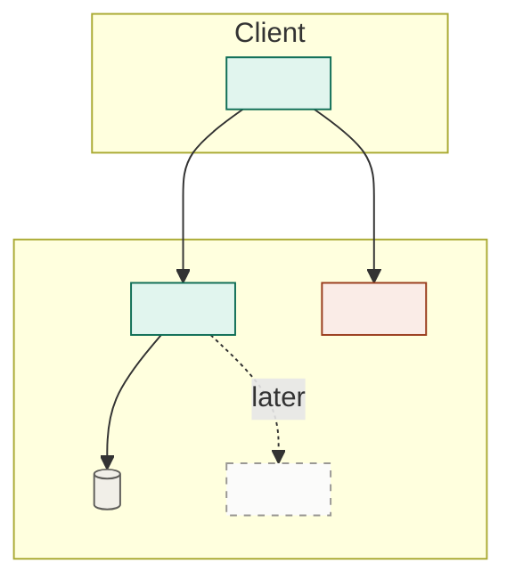

# Active-scope architecture

Produce `docs/active-scope/architecture.md`: the architecture the current scope gets implemented against. This is Phase 4, and it runs once per scope.

Four constraints define it:

- **It refines `docs/project/architecture.md`; it never contradicts it.** The north star says what shape the system takes; this says exactly what to build for these features. See `dev-system` § *The refinement rule*.
- **It extends what already runs without breaking it.**
- **It delivers the scope's features without overengineering.**
- **It's built so later work can grow it** toward full scope.

The tension is the point: detailed enough to build from, lean enough that you aren't building for scope you don't have yet, and shaped so full scope plugs in rather than forcing a rewrite.

> Part of the **dev system** — see the `dev-system` skill for the pipeline, the artifact map, the refinement rule, references, question rules, and the principles that hold across every phase.

## Working conventions

```
docs/
  project/architecture.md      <- the north star; read, never rewritten here
  project/prd.md               <- read where the scope's requirements need it
  active-scope/prd.md          <- read in full; § 1.3 sets this document's reach
  active-scope/architecture.md <- this skill
  design-references/           <- read-only; read it when the scope has UI
```

**The codebase is the previous architecture.** Delivered scopes are wiped (`dev-system` § *The scope cycle*), so from the second scope on there is no earlier scope document to read — what already runs is discovered by reading the code. That is the accepted cost of the wipe, and it makes step 2 real work rather than a formality. Budget for it.

Overengineering is the failure mode here, so make it easy for the operator to spot: for anything beyond the scope's needs, say why it earns its place now.

**References** are plain labels — `project architecture § Key technology choices`, `active-scope prd 3.1.2` — never links. Confirm the section exists before citing it.

## Where the detail goes

"More detailed than the north star" is the whole job, so be concrete about what that means. The north star names a thing; this document names the thing you can start coding against.

| Full-scope architecture says | This document says |
|---|---|
| A component and what it's responsible for | The actual module boundaries, and what crosses each one |
| Conceptual entities and relationships | The fields, keys, types, and which component owns writes |
| "A relational store" | The named product and version, and how the app talks to it |
| "Auth is handled uniformly" | The concrete mechanism, where the check happens, and what an unauthenticated request gets |
| "Errors flow to the client" | The shape of an error, who maps it, and what the user sees |

What it still does **not** say: file trees, function signatures, class layouts, or the internals of any one component. Those are Phase 6's to decide. **If a reader could copy your document into files without making a single design decision, you went a level too far** — and you pre-empted a decision implementation should make in contact with reality.

## Method

1. **Read the inputs.** `docs/project/architecture.md` and `docs/active-scope/prd.md` in full.

   **`active-scope prd § 1.3 Architecture reach` sets how far this document goes** — the minimum to make these features run, or structure laid now for what's coming. That answer, not your judgment, is the setting. If following it would force a rewrite later, say so in a line and follow it anyway; the divergence goes in *Divergence from the north star*.

2. **Read what already runs.** From the second scope on, this is real reading: find the modules, boundaries, data shapes, and conventions the code actually uses. Then sort the scope's work into three kinds, because they carry very different risk:

   - **Adds** — new components standing alongside what runs. The cheap case.
   - **Attaches** — plugs into a seam that already exists. Check the seam is really there and really fits; a seam assumed wrong is far cheaper to find here than mid-implementation.
   - **Changes** — reshapes something already built: splitting a module, promoting an inline thing to a real component, finally adding a layer that was skipped. **This is where regressions come from,** so it gets named explicitly rather than absorbed into "implementation detail."

   Where the code and `docs/project/architecture.md` already disagree, that's pre-existing drift. Note it; don't fix it as a side effect of this scope.

3. **Simplify to the scope.** Drop or stub anything the scope's features don't require. Fewer moving parts is the goal, not fidelity to the full design.

4. **Stay compatible in both directions.** Don't make a choice the full-scope architecture would have to undo, *and* don't make one that fights what's already running. When the two disagree, **reality wins for this scope and you flag the drift** rather than quietly pretending it isn't there. The north star is a north star; some divergence is expected and healthy. What isn't healthy is nobody noticing.

5. **Mark the extension points.** Where full scope's remaining features will later attach, leave a clear seam and a note on how it plugs in. This is what makes the scope growable instead of throwaway. **Write these for a reader who will only have the code** — the next scope's step 2 reads the codebase, not this file, so a seam that isn't obvious from the code needs a name in the code, not just a paragraph here.

6. **Draw it.** One mermaid flowchart — see *Diagram conventions*. Underneath, **one line naming what it proves.** For a scope that's usually restraint: what a reader should notice is how much of the north star isn't there. If your diagram has as many boxes as the full-scope one, you didn't scope it — go back to step 3.

7. **Resist overengineering.** No abstraction, layer, or generality the scope's features don't currently need. If you're adding it "for later," a marked extension point is enough — build it later.

8. **Run the refinement audit** over the finished draft. Open every full-scope section you cited and check it says what you claim.

## Structure

```
# <Project> — Active-scope architecture: <name>

_Reach: <the answer recorded in active-scope prd 1.3>_

## 1. Overview
The scope's structure in a paragraph. Deliberately smaller than the north
star, and deliberately more specific.

## 2. Builds on
What already runs that this scope attaches to, named from the code, and the
seam it lands on. For the first scope: "nothing — first scope." If it
attaches somewhere nothing anticipated, say so; that's a signal, not a detail.

## 3. Diagram
One mermaid flowchart — see Diagram conventions. One line underneath naming
what it proves, plus the four-state legend.

## 4. Components
Only the parts the scope needs. New components only. For each: what it owns,
what it explicitly does not, and what crosses its boundary.

## 5. Changes to existing structure
Anything already built that this scope modifies, splits, promotes, or
replaces — kept separate from what it adds, because the risk is different.
**Empty is a good answer.** Each entry: what changes, why the scope can't
proceed without it, and what could regress.

## 6. Data model
The entities the scope touches, with the detail the north star doesn't
carry — fields, keys, types, ownership of writes. Mark which are new and
which already exist and are being extended.

## 7. Key choices
The picks for this scope, each with a one-line why: a note where it matches
the full-scope architecture, and a note where something already in the code
constrained it. Mark any that would be expensive to reverse.

## 8. Cross-cutting for this scope
How this scope handles auth, errors, state, config, and logging — concretely,
since these are what every task will bind to. Refines the north star's
cross-cutting section; cite it rather than restating it.

## 9. Divergence from the north star
Where this scope knowingly differs from `docs/project/architecture.md`, and
whether that's the scope bending or the north star being out of date.
Include pre-existing drift found in step 2. Omit if none.

## 10. Extension points
Where full scope's remaining features attach later, and how. Name the seam as
it appears in the code, not only here.

## 11. Deliberately deferred
Structure intentionally not built yet, so nobody adds it by reflex.

## 12. Running-cost delta        (include if this scope changes what it costs to run)
What this scope adds to the monthly bill, with the usage assumption on every
line. Omit if nothing changes.
```

## Diagram conventions

Mermaid, so it renders in the repo and stays diffable. Subgraphs for deployment boundaries, `[( )]` cylinders for anything that stores state, weighted edges (plain for the normal path, `==>` for high-volume, `-.->` for scheduled or occasional).

Colour on **one** axis: what this scope does to each component, straight out of method step 2. The subgraphs already carry what kind of thing it is; a diagram carrying two axes stops being readable.



- **Adds** — new in this scope.
- **Changes** — already there, reshaped here. The category worth staring at.
- **Untouched** — already running, not affected. Muted. For the first scope there is none, and the diagram degrades to a plain one.
- **Deferred** — the step-5 seams, as dashed ghosts. Drawing what you are *not* building is what makes it easy to keep not building it.

Two things that bite: set `fill`, `stroke`, and `color` together on every class, because a fill without an explicit text colour inverts badly in the other theme; and escape any literal angle bracket in a label as `&lt;`/`&gt;`, since Mermaid parses labels as HTML and silently eats anything that looks like a tag.

## Refinement audit

Run this over the finished draft and present the table with it. One row per statement whose relationship to the full-scope architecture isn't a clean refinement — **clean refinements don't get rows.**

```
| Active-scope statement | Full-scope parent | Relationship | Action |
|---|---|---|---|
| 7 Queue is in-process | project architecture § Boundaries specifies a broker | contradicts | scope is leaner — record in § 9, or ask |
| 4 Notification service | — | uncovered | north star has no such component — ask |
| 8 Auth model restated | project architecture § Cross-cutting | duplicate | cite it, delete the copy |
| 1 "Layered and modular" | project architecture § Overview | not a refinement | no more specific than its parent — drop |
```

Four kinds of row:

- **Contradicts** — the north star says otherwise. Two legitimate outcomes: it's deliberate divergence, which goes in § 9 with its reason; or the north star is out of date, which the operator decides on. **Never quietly pick a side.**
- **Uncovered** — no parent in the north star. Either full scope has a gap or this scope is growing something nobody sanctioned.
- **Duplicate** — this document restates what the north star already defines. Replace with a reference; the copy will drift.
- **Not a refinement** — a line with a parent that adds nothing to it. Delete it or make it specific. The most common row, and the easiest to wave through.

An empty table is a real result. Say "none found" rather than manufacturing rows.

## Checkpoint

A link to the architecture and the audit table, and the operator's attention on one thing: **what this scope changes in existing structure.** The additive parts are cheap; the changes are where regressions live.

Beyond that, at most: whether any divergence from the north star is deliberate, and any pre-existing drift step 2 found between the code and the north star.

No component-by-component walkthrough, and don't name what runs next.
