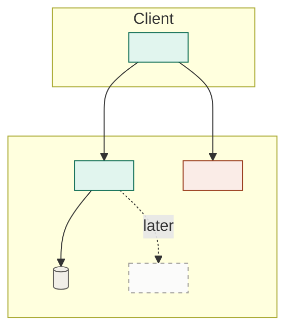

# Active-scope PRD and architecture

Produce two documents in one run: `docs/active-scope/prd.md`, a detailed product description of **the features the operator wants built now**, and `docs/active-scope/architecture.md`, the structure those features get implemented against. This is Phase 3, and it runs once per scope.

Three things define it:

- **The operator names the features.** You don't choose the scope for them. Your job is to take what they asked for, put four bounding questions in front of them, and write the documents.
- **Each refines its full-scope counterpart; neither contradicts it.** This is the whole reason they exist — full scope says what the product is and what shape the system takes; these say what "done" means for these features *right now*, in enough detail to plan and build against. See `dev-system` § *The refinement rule*.
- **Two altitudes, in that order.** The PRD is *what* and *why*, never *how*. The architecture is structure and load-bearing choices, never detailed design. **Finish the PRD before starting the architecture**, and never let a structural decision leak backwards into it. Sharing one run is not permission to blur them.

> Part of the **dev system** — see the `dev-system` skill for the pipeline, the artifact map, the refinement rule, references, question rules, and the principles that hold across every phase.

## Working conventions

```
docs/
  project/prd.md  architecture.md   <- full scope; read, and status-updated by this skill only
  active-scope/                     <- wiped and re-seeded by this run
    prd.md                          <- this skill, step 5
    architecture.md                 <- this skill, step 7
    implementation-plan.md          <- Phase 4
  design-references/                <- read-only, operator-supplied
```

The riskiest thing here is quietly scoping in more than the operator asked for. The second riskiest is wiping a scope whose delivery was never folded back. The third is overengineering the architecture — so for anything beyond the scope's needs, say why it earns its place now.

**The codebase is the previous architecture.** Delivered scopes are wiped (`dev-system` § *The scope cycle*), so from the second scope on there is no earlier scope document to read — what already runs is discovered by reading the code. That is the accepted cost of the wipe, and it makes step 6 real work rather than a formality. Budget for it.

**References** are plain labels — `project prd 3.2.4`, `project architecture § Key technology choices` — never links. Confirm the section exists before citing it.

## Method

### 1. Fold the delivered status back into the project PRD

This is the only durable trace that the finished work happened, so it runs **before** the wipe, never after.

Walk the delivered scope's features to the full-scope requirements they refined, and record the outcome in a **Delivery status** table at the end of `docs/project/prd.md` — appending the section if it isn't there yet:

```
## Delivery status
_Status of the numbered requirements above, updated as each active scope is delivered._

| Requirement | Status | Scope |
|---|---|---|
| 3.1.1–3.1.4 | built | checkout |
| 3.2.1 | partial — guest checkout only; saved cards not built | checkout |
| 5.2 | built | checkout |
```

Three rules:

- **Status only.** Never change what a requirement says while folding, and never delete one because it shipped. The requirement text is full scope's; only the table is yours.
- **`partial` carries what's missing**, in a phrase. A partial marked `built` is the single most expensive error in this system — the missing half then reads as delivered everywhere and nobody ever cuts a scope for it.
- **Truth comes from the plan and the code, not from the scope PRD's intentions.** What the scope claimed it would do is not evidence. Check the plan's checked criteria, and where they're ambiguous, check the code.

**This table is also the answer to "what's left."** Nothing else tracks remaining work, and no document maintains a separate list of it.

Once the table is written, delete `docs/active-scope/prd.md`, `architecture.md`, and `implementation-plan.md`. Leave `docs/design-references/` alone — it belongs to the operator and spans scopes.

### 2. Take stock — briefly

Read `docs/project/prd.md`, including the Delivery status table, and skim what actually exists in the codebase. Two things matter and nothing else does:

- **Claimed is not shipped.** Where the table and the code disagree, the code wins — say so.
- **The missing half of anything marked `partial`** is the easiest thing here to lose, because a partial feature reads as done everywhere else.

This is a skim for context, not the architecture read — that's step 6. And it is not a proposal: **don't produce a recommended scope**, the operator brings that.

### 3. Ask the four bounding questions

One `AskUserQuestion` pass, at most four, options on each with **future-proof** and **cheaper now** always present (see `dev-system` § *Asking the operator*).

| Question | What it settles |
| --- | --- |
| **Boundary** | Confirm what's in and what's carved out. The operator named the features; this is where you offer the boundary calls — a half of a feature that could go either way, a dependency their list implies but doesn't name. If their list is unambiguous, this becomes a confirmation rather than a choice. |
| **Requirements depth** | **What coverage outside the happy path this scope is aiming for** — happy path only, or the error, empty, permission, and concurrent cases specified up front. Whatever isn't specified here doesn't disappear; it becomes an assumption someone makes silently in a task downstream. **Phase 4 reads this answer** to know how much the plan is allowed to leave open. |
| **Architecture reach** | Whether step 7 designs only what these features need to run, or lays the seams for what's coming — one provider hardcoded, versus an interface with that one provider behind it. It's asked of the operator because it's a cost call rather than a technical one: the narrow version ships sooner and gets rewritten when the next scope arrives, the reaching version costs more now and absorbs that scope without a rewrite. Only the operator knows whether that next scope is actually coming. **The architecture is written to this answer, not to your judgment**, so it has to be recorded. |
| **What reaches the user** | What this scope actually puts in front of a user, and how far the PRD pins it down — the behavior only, or the specific screens, states, and copy. A scope can be built end-to-end and still surface almost nothing; settle that here rather than letting Phase 4 discover it. Say what's in `docs/design-references/` when you ask; if it's empty, that itself is a constraint worth naming. |

**A feature the operator asked for that isn't in `docs/project/prd.md` is a gap to raise, not a licence to invent it.** Say so before asking the rest — full scope may be out of date, and updating it is their separate, deliberate act.

### 4. Check the cut holds

Two checks on the operator's answers, and they are the only place you push back:

- **End-to-end, not one layer.** A scope cuts through every layer for a narrow set of features. If what they picked is a layer ("the database work"), say so — nothing will be validatable when it lands.
- **Not a dead end.** The scope must be buildable so later work grows it toward full scope. If the cut forces a rewrite later, say which decision does it and what the alternative is.

Raise either as a single line, then proceed with what they chose.

### 5. Write the PRD

Name the scope — a short slug for what it delivers, `checkout`, `offline-sync`, never its position in a queue. Write `docs/active-scope/prd.md` in the shape below.

**Every functional requirement names its full-scope parent.** Writing that parent is what makes the refinement rule enforceable rather than aspirational, and it's what the audit in step 8 checks. A requirement with no parent is a finding, not a formatting gap.

Number everything, so Phase 4 can cite `active-scope prd 3.1.2` on a single task.

### 6. Read what already runs

Now the real code read. Find the modules, boundaries, data shapes, and conventions the code actually uses, then sort the scope's work into three kinds, because they carry very different risk:

- **Adds** — new components standing alongside what runs. The cheap case.
- **Attaches** — plugs into a seam that already exists. Check the seam is really there and really fits; a seam assumed wrong is far cheaper to find here than mid-implementation.
- **Changes** — reshapes something already built: splitting a module, promoting an inline thing to a real component, finally adding a layer that was skipped. **This is where regressions come from,** so it gets named explicitly rather than absorbed into "implementation detail."

Where the code and `docs/project/architecture.md` already disagree, that's pre-existing drift. Note it; don't fix it as a side effect of this scope.

### 7. Write the architecture

Read `docs/project/architecture.md` in full, and write `docs/active-scope/architecture.md` in the shape below. **§ 1.3 of the PRD you just wrote sets how far it goes** — that answer, not your judgment, is the setting. If following it would force a rewrite later, say so in a line and follow it anyway; the divergence goes in the architecture's § 9.

Five rules:

- **Simplify to the scope.** Drop or stub anything the scope's features don't require. Fewer moving parts is the goal, not fidelity to the full design.
- **Stay compatible in both directions.** Don't make a choice the full-scope architecture would have to undo, *and* don't make one that fights what's already running. When the two disagree, **reality wins for this scope and you flag the drift** — some divergence from the north star is expected and healthy; nobody noticing isn't.
- **Mark the extension points.** Where full scope's remaining features will later attach, leave a clear seam and a note on how it plugs in. **Write these for a reader who will only have the code** — the next scope's step 6 reads the codebase, not this file, so a seam that isn't obvious from the code needs a name in the code, not just a paragraph here.
- **Resist overengineering.** No abstraction, layer, or generality the scope's features don't currently need. If you're adding it "for later," a marked extension point is enough — build it later.
- **Draw it.** One mermaid flowchart, per *Diagram conventions*. If it has as many boxes as the full-scope one, you didn't scope it — go back and simplify.

**Where the detail goes.** "More detailed than the north star" is the whole job. The north star names a thing; this names the thing you can start coding against.

| Full-scope architecture says | This document says |
|---|---|
| A component and what it's responsible for | The actual module boundaries, and what crosses each one |
| Conceptual entities and relationships | The fields, keys, types, and which component owns writes |
| "A relational store" | The named product and version, and how the app talks to it |
| "Auth is handled uniformly" | The concrete mechanism, where the check happens, and what an unauthenticated request gets |
| "Errors flow to the client" | The shape of an error, who maps it, and what the user sees |

What it still does **not** say: file trees, function signatures, class layouts, or the internals of any one component. Those are Phase 5's to decide. **If a reader could copy your document into files without making a single design decision, you went a level too far** — and you pre-empted a decision implementation should make in contact with reality.

### 8. Run the refinement audit

Do this as a real pass over both finished drafts — open every full-scope section you cited and check it says what you claim. See *Refinement audit* below.

## PRD structure

```
# <Project> — Active scope: <name>

_Defined: <YYYY-MM-DD>_

## 1. Scope decisions
The four answers, one line each — boundary, requirements depth, architecture
reach, what reaches the user. This is what the scope was defined against, and
what a later reader checks drift against. The architecture is written to 1.3;
Phase 4 reads 1.2.

1.1 What's in — the features, one line each, each naming its full-scope parent
1.2 Requirements depth — the coverage aimed for outside the happy path
1.3 Architecture reach — how far the architecture designs beyond these features
1.4 What reaches the user — the surface this scope puts in front of them

## 2. What this scope delivers
A paragraph: what a user can do end-to-end once this is built that they
couldn't before. If you can't write it without "and then later", the scope
isn't end-to-end.

Then a bullet list, one line per person the scope changes something for —
"As a user, I can …", "As an operator, I can …", and whoever else this scope
actually touches (an admin, a support agent, a downstream service). Each line
is a capability that exists only once this scope lands, in that role's own
words. A role whose day is unchanged by this scope doesn't get a line, and
neither does a capability that already works today.

## 3. Features
One numbered subsection per feature (3.1, 3.2, …). Each becomes a group in
the implementation plan, so write them as things a user can do. For each:
- _Refines: <full-scope parent, e.g. project prd 3.2>_
- **Functional requirements** — numbered (3.1.1, 3.1.2, …), each concrete
  enough that a test could be written against it, and each ending in the
  parent it refines: `(refines 3.2.1)`.
- A requirement with no parent gets `(uncovered)` and goes in the audit.

The detail test applies to every line: if full scope already says it, cite it
instead of restating it. This document earns its place by being *more*
specific — real limits, real states, real numbers.

## 4. Data detail
The entities this scope touches: the fields it actually needs, who sets each,
and which are new versus already existing. Refines the full-scope data
section — conceptual, not schemas.

## 5. Interface detail            (include when the scope has UI)
What the user sees and does, per feature — screens, states, empty and error
presentation, to the depth set in 1.4. Cite `design-references/<file>` where
one covers it. This is interface *behavior*, not visual design.

## 6. Non-functional requirements
Table — Category | Requirement | Refines. Only the ones this scope must
actually meet now. A full-scope NFR this scope isn't held to goes in 7.

## 7. Out of scope
What a reader would reasonably expect here and isn't getting, each with a
phrase on why. This is the anti-scope-creep lever — the more specific it is,
the smaller the plan stays.
```

**Don't maintain a "still remaining" list.** The Delivery status table in `docs/project/prd.md` is the only record of what's left; a second copy here would be wiped with the scope and wrong before then.

## Architecture structure

```
# <Project> — Active-scope architecture: <name>

_Reach: <the answer recorded in active-scope prd 1.3>_

## 1. Overview
The scope's structure in a paragraph. Deliberately smaller than the north
star, and deliberately more specific.

## 2. Builds on
What already runs that this scope attaches to, named from the code, and the
seam it lands on. For the first scope: "nothing — first scope." If it
attaches somewhere nothing anticipated, say so; that's a signal, not a detail.

## 3. Diagram
One mermaid flowchart — see Diagram conventions. One line underneath naming
what it proves (for a scope, that is usually restraint: what a reader should
notice is how much of the north star isn't there), plus the four-state legend.

## 4. Components
Only the parts the scope needs, and only new ones. For each: what it owns,
what it explicitly does not, and what crosses its boundary.

## 5. Changes to existing structure
Anything already built that this scope modifies, splits, promotes, or
replaces — kept separate from § 4, because the risk is different.
**Empty is a good answer.** One row each:

| Change | Why the scope can't proceed without it | Risk | What could regress |

**Risk** is rated on two things and nothing else, and the entry names which
one it is: how hard the change is to undo once code depends on it, and what
it adds to the cost of maintaining the code afterwards. Write `low`,
`medium`, or `high` plus the phrase that earns it — "high: every caller of
the old signature moves, and they're spread across three modules". Easy to
undo and free to maintain is `low`, in one word.

## 6. Data model
The entities the scope touches, with the detail the north star doesn't
carry — fields, keys, types, ownership of writes. Mark which are new and
which already exist and are being extended.

## 7. Key choices
The picks for this scope, each with a one-line why: where it matches the
full-scope architecture, and where something already in the code constrained
it. Mark any that would be expensive to reverse.

## 8. Cross-cutting for this scope
How this scope handles auth, errors, state, config, and logging —
concretely, since these are what every task binds to. Cite the north star's
cross-cutting section rather than restating it.

## 9. Divergence from the north star
Where this scope knowingly differs from `docs/project/architecture.md`, and
whether that's the scope bending or the north star being out of date.
Include pre-existing drift found in step 6. Omit if none.

## 10. Extension points
Where full scope's remaining features attach later, and how. Name the seam as
it appears in the code, not only here.

## 11. Deliberately deferred
Structure intentionally not built yet, so nobody adds it by reflex.

## 12. Running-cost delta        (include if this scope changes what it costs to run)
What this scope adds to the monthly bill, with the usage assumption on every
line. Omit if nothing changes.
```

## Diagram conventions

Mermaid, so it renders in the repo and stays diffable. Subgraphs for deployment boundaries, `[( )]` cylinders for anything that stores state, weighted edges (plain for the normal path, `==>` for high-volume, `-.->` for scheduled or occasional).

Colour on **one** axis: what this scope does to each component, straight out of step 6. The subgraphs already carry what kind of thing it is; a diagram carrying two axes stops being readable.



- **Adds** — new in this scope.
- **Changes** — already there, reshaped here. The category worth staring at.
- **Untouched** — already running, not affected. Muted. For the first scope there is none, and the diagram degrades to a plain one.
- **Deferred** — the § 10 and § 11 seams, as dashed ghosts. Drawing what you are *not* building is what makes it easy to keep not building it.

Two things that bite: set `fill`, `stroke`, and `color` together on every class, because a fill without an explicit text colour inverts badly in the other theme; and escape any literal angle bracket in a label as `&lt;`/`&gt;`, since Mermaid parses labels as HTML and silently eats anything that looks like a tag.

## Refinement audit

One pass over both finished drafts, one table, presented with them. One row per statement whose relationship to full scope isn't a clean refinement — **clean refinements don't get rows.** Prefix each statement with the document it's in.

```
| Active-scope statement | Full-scope parent | Relationship | Action |
|---|---|---|---|
| prd 3.1.4 Cart holds 50 items max | project prd 3.2.1 says 100 | contradicts | full scope is older — ask which holds |
| prd 3.3.2 Guest checkout | — | uncovered | nothing in full scope allows it — ask |
| arch 7 Queue is in-process | project architecture § Boundaries specifies a broker | contradicts | scope is leaner — record in arch § 9, or ask |
| arch 4 Notification service | — | uncovered | north star has no such component — ask |
| prd 5 Order states listed | project prd 4.2 defines them | duplicate | cite 4.2, delete the copy |
| arch 1 "Layered and modular" | project architecture § Overview | not a refinement | no more specific than its parent — drop |
```

Four kinds of row:

- **Contradicts** — full scope says otherwise. Never resolve it by picking a side. For the PRD: either fix the document, or tell the operator full scope needs updating. For the architecture there is one more legitimate outcome — deliberate divergence, which goes in its § 9 with the reason.
- **Uncovered** — no parent exists. Either full scope has a gap or scope crept in. **Never invent the parent.**
- **Duplicate** — restates what full scope already defines. Replace with a reference; the copy will drift.
- **Not a refinement** — a line that has a parent and adds nothing to it. Either make it more specific or delete it. This is the most common row and the easiest to wave through.

Where nothing owns the fact, write `—` in *Full-scope parent*. An empty table is a real result — say "none found" rather than manufacturing rows.

## Checkpoint

Link to both documents and the audit table. Beyond that, only what the operator wouldn't anticipate:

- **what the architecture changes in existing structure**, and anything there rated `medium` or `high` risk. The additive parts are cheap; the changes are where regressions live.
- what the stock-take turned up that they'd be surprised by — work they thought was done and isn't, or the reverse;
- **whether a fold-back marked anything `partial`**, and what's missing from it;
- whether any divergence from the north star is deliberate, and any pre-existing drift step 6 found between the code and the north star.

If the stock-take revealed `docs/project/prd.md` no longer describes what the project is becoming, say so in a line. Updating full scope is a separate, deliberate act.

Don't summarize the features back at them, don't walk the architecture component by component, and don't name what runs next.
