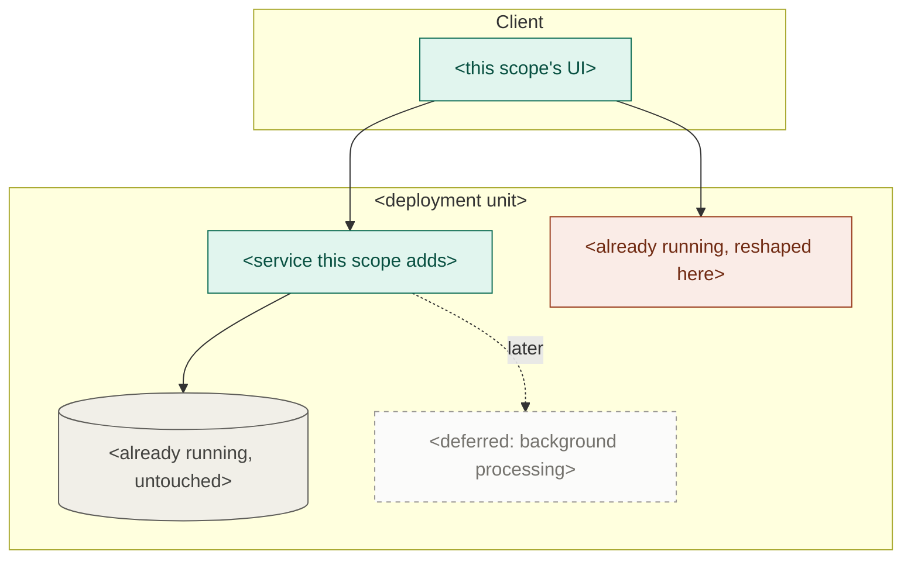

# Active-scope PRD

Produce `docs/active-scope/prd.md`, a detailed product description of **the features the operator wants built now**. This is Phase 3, and it runs once per scope.

Two things define it:

- **The operator names the features.** You don't choose the scope for them. Your job is to take what they asked for, put three bounding questions in front of them, and write the document.
- **It refines the project PRD; it never contradicts it.** That is the whole reason it exists — full scope says what the product is; this says what "done" means for these features *right now*, in enough detail to plan and build against. See `dev-system` § *The refinement rule*.

The PRD is *what* and *why*, never *how*. Structure is the project architecture's job, and the plan cites it directly.

> Part of the **dev system** — see the `dev-system` skill for the pipeline, the artifact map, the refinement rule, references, question rules, and the principles that hold across every phase.

## Working conventions

```
docs/
  project/prd.md  architecture.md   <- full scope; read only
  active-scope/
    prd.md                          <- this skill
    implementation-plan.md          <- Phase 4
  design-references/                <- read-only, operator-supplied
```

The riskiest thing here is quietly scoping in more than the operator asked for.

**References** are plain labels — `project prd 3.2.4`, `project architecture § Key technology choices` — never links. Confirm the section exists before citing it.

## Method

### 1. Read the project PRD

Read `docs/project/prd.md`, including the Delivery status table. One thing matters beyond the requirements themselves: **the missing half of anything marked `partial`**, because a partial feature reads as done everywhere else.

This is not a proposal — **don't produce a recommended scope**, the operator brings that.

### 2. Ask the three bounding questions

One `AskUserQuestion` pass, at most three, options on each with **future-proof** and **cheaper now** always present (see `dev-system` § *Asking the operator*).

| Question | What it settles |
| --- | --- |
| **Boundary** | Confirm what's in and what's carved out. The operator named the features; this is where you offer the boundary calls — a half of a feature that could go either way, a dependency their list implies but doesn't name. If their list is unambiguous, this becomes a confirmation rather than a choice. |
| **Requirements depth** | **What coverage outside the happy path this scope is aiming for** — happy path only, or the error, empty, permission, and concurrent cases specified up front. Whatever isn't specified here doesn't disappear; it becomes an assumption someone makes silently in a task downstream. **Phase 4 reads this answer** to know how much the plan is allowed to leave open. |
| **What reaches the user** | What this scope actually puts in front of a user, and how far the PRD pins it down — the behavior only, or the specific screens, states, and copy. A scope can be built end-to-end and still surface almost nothing; settle that here rather than letting Phase 4 discover it. Say what's in `docs/design-references/` when you ask; if it's empty, that itself is a constraint worth naming. |

**A feature the operator asked for that isn't in `docs/project/prd.md` is a gap to raise, not a licence to invent it.** Say so before asking the rest — full scope may be out of date, and updating it is their separate, deliberate act.

### 3. Check the cut holds

Two checks on the operator's answers, and they are the only place you push back:

- **End-to-end, not one layer.** A scope cuts through every layer for a narrow set of features. If what they picked is a layer ("the database work"), say so — nothing will be validatable when it lands.
- **Not a dead end.** The scope must be buildable so later work grows it toward full scope. If the cut forces a rewrite later, say which decision does it and what the alternative is.

Raise either as a single line, then proceed with what they chose.

### 4. Write the PRD

Name the scope — a short slug for what it delivers, `checkout`, `offline-sync`, never its position in a queue. Write `docs/active-scope/prd.md` in the shape below.

**Every functional requirement names its full-scope parent.** Writing that parent is what makes the refinement rule enforceable rather than aspirational. A requirement with no parent gets `(uncovered)` and goes to the operator as a question — **never invent the parent.**

Number everything, so Phase 4 can cite `active-scope prd 3.1.2` on a single task.

The detail test applies to every line: **if full scope already says it, cite it instead of restating it.** This document earns its place by being *more* specific — real limits, real states, real numbers. A line that has a parent and adds nothing to it is either made more specific or deleted.

## PRD structure

```
# <Project> — Active scope: <name>

_Defined: <YYYY-MM-DD>_

## 1. Scope decisions
The three answers, one line each. This is what the scope was defined against,
and what a later reader checks drift against. Phase 4 reads 1.2.

1.1 What's in — the features, one line each, each naming its full-scope parent
1.2 Requirements depth — the coverage aimed for outside the happy path
1.3 What reaches the user — the surface this scope puts in front of them

## 2. What this scope delivers
A paragraph: what a user can do end-to-end once this is built that they
couldn't before. If you can't write it without "and then later", the scope
isn't end-to-end.

Then a bullet list, one line per person the scope changes something for —
"As a user, I can …", "As an operator, I can …", and whoever else this scope
actually touches (an admin, a support agent, a downstream service). Each line
is a capability that exists only once this scope lands, in that role's own
words. A role whose day is unchanged by this scope doesn't get a line, and
neither does a capability that already works today.

## 3. Features
One numbered subsection per feature (3.1, 3.2, …). Each becomes a group in
the implementation plan, so write them as things a user can do. For each:
- _Refines: <full-scope parent, e.g. project prd 3.2>_
- **Functional requirements** — numbered (3.1.1, 3.1.2, …), each concrete
  enough that a test could be written against it, and each ending in the
  parent it refines: `(refines 3.2.1)`.
- A requirement with no parent gets `(uncovered)` and goes to the operator.

## 4. Data detail
The entities this scope touches: the fields it actually needs, who sets each,
and which are new versus already existing. Refines the full-scope data
section — conceptual, not schemas.

## 5. Interface detail            (include when the scope has UI)
What the user sees and does, per feature — screens, states, empty and error
presentation, to the depth set in 1.3. Cite `design-references/<file>` where
one covers it. This is interface *behavior*, not visual design.

## 6. Non-functional requirements
Table — Category | Requirement | Refines. Only the ones this scope must
actually meet now. A full-scope NFR this scope isn't held to goes in 7.

## 7. Out of scope
What a reader would reasonably expect here and isn't getting, each with a
phrase on why. This is the anti-scope-creep lever — the more specific it is,
the smaller the plan stays.

## 8. Diagram
One mermaid flowchart — see Diagram conventions — showing what this scope
touches and, just as importantly, what it doesn't. One line underneath naming
what it proves (usually restraint: how much of the north star isn't there),
plus the four-state legend.
```

**Don't maintain a "still remaining" list.** The Delivery status table in `docs/project/prd.md` is the only record of what's left; a second copy here would be wiped with the scope and wrong before then.

## Diagram conventions

Mermaid, so it renders in the repo and stays diffable. Subgraphs for deployment boundaries, `[( )]` cylinders for anything that stores state, weighted edges (plain for the normal path, `==>` for high-volume, `-.->` for scheduled or occasional).

Colour on **one** axis: what this scope does to each component. The subgraphs already carry what kind of thing it is; a diagram carrying two axes stops being readable.



- **Adds** — new in this scope.
- **Changes** — already there, reshaped here. The category worth staring at.
- **Untouched** — already running, not affected. Muted. For the first scope there is none, and the diagram degrades to a plain one.
- **Deferred** — what full scope has and this scope isn't building, as dashed ghosts. Drawing what you are *not* building is what makes it easy to keep not building it.

Two things that bite: set `fill`, `stroke`, and `color` together on every class, because a fill without an explicit text colour inverts badly in the other theme; and escape any literal angle bracket in a label as `&lt;`/`&gt;`, since Mermaid parses labels as HTML and silently eats anything that looks like a tag.

## Checkpoint

Link to the document. Beyond that, only what the operator wouldn't anticipate:

- any requirement that came out `(uncovered)` — no parent in full scope, so either full scope has a gap or scope crept in;
- **anything the Delivery status table marks `partial`** that this scope is building on, and what's missing from it;
- either cut check from step 3 that you had to raise.

If `docs/project/prd.md` no longer describes what the project is becoming, say so in a line. Updating full scope is a separate, deliberate act.

Don't summarize the features back at them and don't name what runs next.
