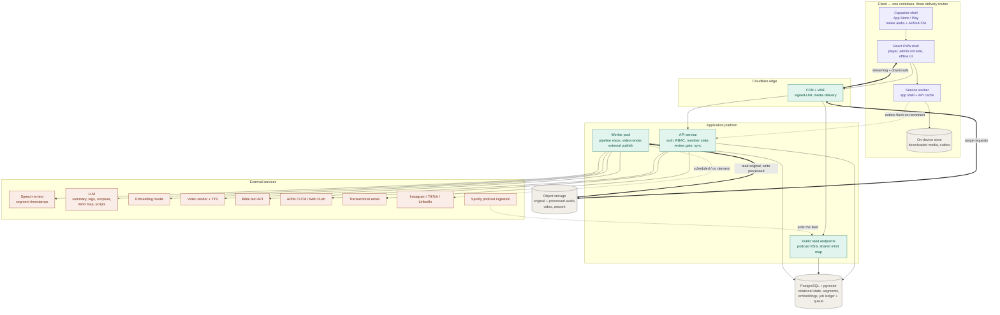

## Decisions refined

list decisions

## Diagram

## Data detail

Refines project prd §4. Conceptual — project architecture § Data model holds how these relate.

**Tag** _(new — project prd 4.7)_

| Field           | Set by    | Notes                                               |
| :-------------- | :-------- | :-------------------------------------------------- |
| Name            | Admin-set | 1–40 characters, unique case-insensitively (3.1.1) |
| Created at / by | Auto-set  | Which admin brought the tag into the taxonomy       |

**Recording ↔ tag** _(new)_ — the application of a tag to a recording, carrying whether the machine proposed it and whether an admin changed it (4.17.5), at most 12 per recording (3.1.7).

**Mind map** _(new — project prd 4.9)_

| Field                   | Set by                                              | Notes                                                                                                        |
| :---------------------- | :-------------------------------------------------- | :----------------------------------------------------------------------------------------------------------- |
| Source recording        | Auto-set                                            | Videos are not a source in this scope (3.3.1)                                                                |
| Kind                    | Auto-set                                            | Recording map or personal map (4.9)                                                                          |
| Generated by            | Auto-set                                            | Empty for a recording map; the member for a personal map — this is what determines visibility (4.9)         |
| Date generated          | Auto-set                                            | Sort key in the personal library (3.3.6)                                                                     |
| Generation state        | Auto-set                                            | Generating, ready or failed — personal maps only, since a recording map's state is its pipeline job (3.3.5) |
| Nodes and relationships | AI-generated; admin-editable on recording maps only | Label, parent, optional timestamp; at most 40 nodes, depth at most 3 (3.2.2, 3.3.9)                          |
| Share token             | User-set                                            | Personal maps only, opaque, reversible (3.3.11, 3.3.13)                                                      |

A map carries no title; the source recording's title labels it (project prd 4.9).

**Highlight** _(existing, extended)_ — gains a tag target alongside the recording, moment and note targets it already carries, so a topic pin is a fourth kind of the same entry (3.1.11).

**Review item** _(existing, extended)_ — gains `tags` and `mind_map` as kinds of the same item, per 4.17.6. No new queue.

**Pipeline job** _(existing, extended)_ — gains mind map generation as a step (3.8.1). Every other field is unchanged.

**Notification** _(existing, extended)_ — `push` joins `in_app` as a delivered channel (4.16).

**Notification preference** _(new — project prd 4.1)_ — per user, per event category, on by default (3.7.5). Belongs to the member-owned cluster and is removed with the account.

**Push subscription** _(new)_ — per user per device: the route it belongs to, the transport's own identifier, and when it was last seen. Removed on sign-out, on account deletion, and when the transport reports it gone (3.7.3, 3.7.11, 3.7.13).

**Download** _(new, client-side only)_ — held on the device, never on the server: which recordings are downloaded, their bytes, the artefacts downloaded with them (3.5.3), file size and date. The server keeps no record of what a member has downloaded.

**Outbox entry** _(new, client-side only)_ — a pending write made offline: what it is, its payload, the time it was written, and its attempt count (3.6.7, 3.6.11).
