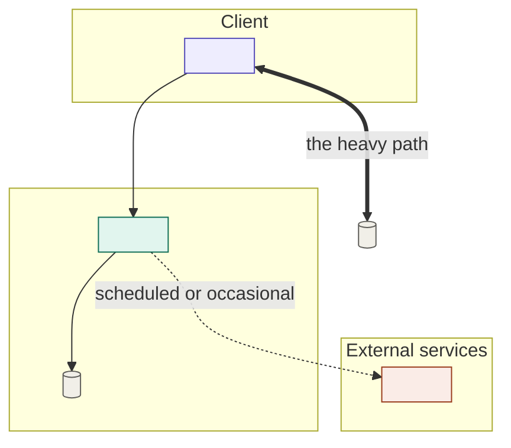

# Full-scope architecture

Produce `docs/architecture.md`: one standard for the whole project, designed so everything in the PRD can be supported. This is Phase 2.

**It is a north star, not a contract.** As iteration diverges from it later, that's expected — it guides direction, it doesn't bind every decision. Write it at that altitude: high-level structure and the choices that are expensive to reverse, not detailed design.

> Part of the **dev system** — see the `dev-system` skill for the full pipeline, the artifact map, and the principles that hold across every phase.

## Working conventions (shared across the dev system)

Artifacts live under `docs/` by default (change here and stay consistent):

- `docs/prd.md` — full-scope PRD (read this)
- `docs/architecture.md` — full-scope architecture (this skill)
- `docs/slice-prd.md`, `docs/slice-architecture.md`, `docs/implementation-plan.md`
- `docs/steps/<NN>-<slug>.md` — per-step working docs
- `docs/completed-slices/<NN>-<slug>/` — slices already delivered, archived whole

Control comes from the operator reviewing each checkpoint and pushing back. Surface the load-bearing decisions plainly; don't bury a big call inside prose.

**Reference links.** Write every section reference as a markdown link to the file and line it lives at — `[3.2.4](docs/prd.md#L142)`, `[slice-prd.md § In scope → Auth](docs/slice-prd.md#L34)` — with the visible text left as the plain reference. Resolve the line by finding the heading (`grep -n`); never guess it. See the `dev-system` skill for the full rule.

## Method

1. **Read `docs/prd.md` fully.** The one job here is a structure that can support *everything* in the PRD.
2. **Coverage check.** Walk the PRD's features and flows and make sure each has a home in the architecture. If a feature has no clean home, that's a signal — flag it (the PRD may need a decision) rather than bolting on a special case.
3. **Pick the load-bearing choices, justify them briefly.** Language/runtime, data store, the major boundaries, how state and errors flow, cross-cutting concerns (auth, observability, config). One or two sentences of rationale each — enough to review, not a thesis.
4. **Mark the expensive reversals.** Any choice that would be painful to undo gets said so in place, next to its rationale — so later divergence from it is a conscious act, not an accident.
5. **Draw the system.** One mermaid flowchart carrying every component from step 3 and how they connect. Group nodes into subgraphs by **deployment boundary** — client, edge, each host or deployment unit, external services — because that grouping is the thing a component list can't convey. Give the edges meaning: a plain arrow for the normal request path, a thick one for the high-volume path, a dotted one for scheduled or occasional flows. Then write **one line underneath naming what the diagram proves** — the structural fact you want a reader to leave with. If nothing in the picture is surprising, you either drew the wrong thing or the architecture has no shape worth defending yet.
6. **Cost it, with the usage behind each number showing.** Estimate what running this costs per month: compute, storage, bandwidth/egress, and every external or per-use service. Each usage-based line names the volume it assumes ("~8 hrs of audio/month", "~50k requests/day") — a figure with its assumption hidden can't be reviewed and can't be re-derived when usage changes. Ranges beat false precision. Keep one-time costs (migration, backfill, setup) out of the recurring table and list them separately. Cost it at **launch scale and at the PRD's target scale**: a line that's trivial at 100 users and dominant at 10,000 is an architecture signal, not an accounting detail — say which decision it would change.
7. **Stay high-level.** Name components and their responsibilities and how they talk. Don't design schemas field-by-field or specify file trees — that's for implementation.

## Structure

```
# <Project> — Architecture (north star)

## Overview
The shape of the system in a paragraph.

## System diagram
The whole system in one mermaid flowchart — see Diagram conventions below.
One line underneath naming what it proves.

## Components & responsibilities
Each major part, what it owns, what it doesn't.

## Data model
Core entities and relationships at a conceptual level.

## Key technology choices
The load-bearing picks, each with a one-line why, and a note on any that
would be expensive to reverse.

## Boundaries & integration
How components and any external systems communicate.

## Cross-cutting concerns
Auth, state management, error handling, observability, config — however the
project handles them uniformly.

## Scalability & growth posture
Where this is built to stretch, and where it deliberately isn't yet.

## Estimated running costs      (include whenever the project has running costs)
Table — Item | Monthly — with the usage assumption stated on every
usage-based line, and a total. One-time costs listed separately underneath.
Close by naming the line that dominates at target scale and the decision it
would change if it moved.
```

## Diagram conventions

Mermaid, so it renders in the repo and stays diffable. The skeleton below carries the conventions worth keeping — subgraphs for boundaries, `[( )]` cylinders for anything that stores state, weighted edges, and one class per category:



Two things that bite: set `fill`, `stroke`, and `color` together on every class, because a fill without an explicit text color inverts badly when the page renders in the other theme; and escape any literal angle bracket in a label as `&lt;`/`&gt;`, since Mermaid parses labels as HTML and silently eats anything that looks like a tag. Real diagrams name real components, so the second one only bites on placeholders.

## Checkpoint

Link the architecture and keep the chat to what the operator wouldn't anticipate from reading it: the choices that are expensive to reverse, and any PRD feature that resisted a clean home. Don't tour the components or restate the stack — that's the document's job. (See *What goes in the chat* in the `dev-system` skill.) If a cost line looks like it would force a different decision at target scale, say so here rather than leaving it buried in the table. Hand control back before moving to slicing. Keep it a north star — resist the pull to over-specify now.

**Next step.** End the checkpoint with a single sentence naming what runs next — e.g. *"Next: Phase 3, `vertical-slice-prd`, to cut the first ~20% slice out of full scope."* Suggest it; don't run it.
