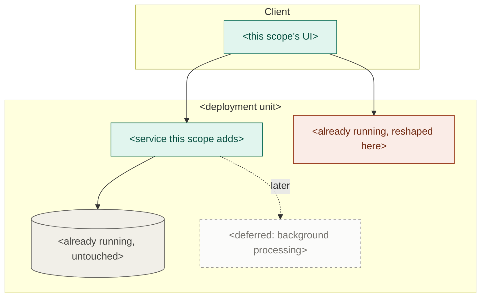

# Scope PRD

Produce `docs/scope/prd.md`, a detailed product description of **the features the operator wants built now**. This is Phase 3, and it runs once per scope.

**The operator names the features.** You don't choose the scope for them. What this phase adds to their list is three jobs, and the document is judged on all three:

- **Pull the references.** Everything this scope builds against is named here, once: the project-PRD requirements it refines, the project-PRD sections it draws on, the design references it renders against. Phases 4 and 5 then read what this document points at, instead of re-deriving it from the project PRD every time.
- **Draw the hard limit.** What this scope will *not* do, written as a ceiling rather than a caveat. It is the only lever in the system against bloat, and every phase after this one is bound by it.
- **Expand the requirements.** Each project requirement the scope claims is expanded into detailed functional requirements — real limits, real states, real numbers — so Phase 4 can name a failing test for every one of them without asking anything.

**It refines the project PRD; it never contradicts it.** That is the whole reason it exists — the project PRD says what the product is; this says what "done" means for these features *right now*, in enough detail to plan and build against. See `dev-system` § *The refinement rule*.

The PRD is *what* and *why*, never *how*. Structure is the project architecture's job, and the plan cites it directly — which is also why the references you pull are product-level, never architectural.

> Part of the **dev system** — see the `dev-system` skill for the pipeline, the artifact map, the refinement rule, references, question rules, and the principles that hold across every phase.

## Working conventions

```
docs/
  project/prd.md                    <- the project PRD; read in full, and the
                                       source of most of what § 1.4 pulls
  project/architecture.md           <- not read here; Phase 4 cites it
  scope/
    prd.md                          <- this skill
    implementation-plan.md          <- Phase 4
  design-references/                <- read-only, operator-supplied
```

The riskiest thing here is quietly scoping in more than the operator asked for. The hard limit (§ 7, step 5) is what you write instead.

**References** are plain labels — `project prd 3.2.4`, `design-references/checkout-mock.png` — never links, and every one is confirmed with `grep` before it is written down.

## Method

### 1. Read the project PRD, and pull what this scope builds against

Read `docs/project/prd.md`, including the Delivery status table. One thing matters beyond the requirements themselves: **the missing half of anything marked `partial`** — the blockers listed under those requirements are what a scope building on them inherits, and a partial feature reads as done everywhere else.

Then pull the references, in the same pass. **This is the only phase that reads the project PRD whole**, so a reference not pulled here is one Phase 4 re-derives or Phase 5 guesses at:

- **the project-PRD requirement each named feature refines**, by number — this is the parent every functional requirement below will end in;
- **the project-PRD sections the scope draws on beyond its own requirements** — the data it touches, the non-functional requirements it is held to, a glossary term it depends on;
- **the design references** in `docs/design-references/` covering the surface this scope puts in front of a user, by filename.

Two rules on the pull, both from `dev-system` § *References*: **confirm every one exists** with `grep` before it goes in, and **cite the smallest section that carries the fact**. A reference resolving to a real heading that says nothing about this scope is worse than a missing one — Phase 4 will cite it and Phase 5 will read it, find nothing, and assume.

**Pull what the scope builds against, not everything adjacent.** This becomes the scope's reading list, and a reading list nobody can finish is one nobody reads.

This is not a proposal — **don't produce a recommended scope**, the operator brings that.

### 2. Ask the three bounding questions

One `AskUserQuestion` pass, at most three, options on each with **future-proof** and **cheaper now** always present (see `dev-system` § *Asking the operator*).

| Question | What it settles |
| --- | --- |
| **Boundary** | Confirm what's in and what's carved out. The operator named the features; this is where you offer the boundary calls — a half of a feature that could go either way, a dependency their list implies but doesn't name. **Their answer is what step 5 writes as the hard limit**, so ask it as a line rather than a leaning: what is carved out stays carved out for the whole scope. If their list is unambiguous, this becomes a confirmation rather than a choice. |
| **Requirements depth** | **What coverage outside the happy path this scope is aiming for** — happy path only, or the error, empty, permission, and concurrent cases specified up front. Whatever isn't specified here doesn't disappear; it becomes an assumption someone makes silently in a task downstream. **Phase 4 reads this answer** to know how much the plan is allowed to leave open. |
| **What reaches the user** | What this scope actually puts in front of a user, and how far the PRD pins it down — the behavior only, or the specific screens, states, and copy. A scope can be built end-to-end and still surface almost nothing; settle that here rather than letting Phase 4 discover it. Say what's in `docs/design-references/` when you ask; if it's empty, that itself is a constraint worth naming. |

**A feature the operator asked for that isn't in `docs/project/prd.md` is a gap to raise, not a licence to invent it.** Say so before asking the rest — the project PRD may be out of date, and updating it is their separate, deliberate act.

### 3. Check the cut holds

Two checks on the operator's answers, and they are the only place you push back:

- **End-to-end, not one layer.** A scope cuts through every layer for a narrow set of features. If what they picked is a layer ("the database work"), say so — nothing will be validatable when it lands.
- **Not a dead end.** The scope must be buildable so later work grows it toward the whole project. If the cut forces a rewrite later, say which decision does it and what the alternative is.

Raise either as a single line, then proceed with what they chose.

### 4. Expand each parent into functional requirements

This is where the document earns its place. A parent in the project PRD is one line written to survive the whole project; this scope needs it as several lines someone can build and test against this week.

**One child per parent is not an expansion** — it is the parent restated one altitude lower, and it leaves every decision the parent didn't make to whoever ends up writing the code. Expand every parent the scope claims, to the depth § 1.2 settled, and make each requirement you write carry at least one thing the parent doesn't:

- a **limit or a number** — how many, how long, how large, how often;
- a **state** — what this looks like empty, loading, stale, expired, already done;
- a **failure** — what happens when it doesn't work, and what the user sees when it doesn't;
- a **permission** — who can do it, and what someone who can't gets instead;
- an **ordering or timing rule** — what has to happen first, what can happen at once;
- **the exact user-visible wording**, wherever the wording is the requirement.

**The depth answer bounds this in both directions.** *Happy path only* means the error and empty cases are deliberately unspecified — they go in § 7 rather than getting expanded anyway. *Full coverage* means a requirement that names a failure without saying what the user sees is unfinished.

**The bar is a test.** Read each requirement back and ask what test would fail if the code didn't do it. If you can't name one, the requirement is still at project altitude: expand it, split it, or cut it. Phase 4 has to write that test onto a criterion, and it reads this document rather than asking you.

### 5. Draw the hard limit

§ 7 is not a list of afterthoughts. **It is the ceiling for the rest of the scope** — the one thing standing between a two-feature scope and the five-feature one it becomes by delivery.

Two rules make it hold:

- **Anything not written in this document is out.** The limit isn't only what § 7 lists; it's the whole document. § 7 exists for the exclusions a reader would otherwise assume were in, because assuming them is exactly how a plan grows a group nobody asked for.
- **Only the operator raises it.** Phase 4 doesn't plan past it, Phase 5 doesn't build past it, and neither do you once the operator has answered. Something that has to come in goes back to them as a question and gets written into this document — scope is never widened by a task that quietly covers more.

Write each exclusion as **what a reader would reasonably expect here, plus the phrase that says why it isn't coming** — deferred to a later scope, already covered by something built, or simply not wanted. *"Saved cards — a later scope; this one takes a card per purchase"* is a limit. *"Advanced payment features"* is not: nobody can tell whether their idea falls inside it, so everyone decides for themselves.

Three places to check before you finish, because they are where excluded work quietly returns: the **half-features the boundary question carved** (the other side of § 1.1), the **project-PRD non-functional requirements this scope isn't held to** (§ 6 names the ones it is), and **the coverage § 1.2 deliberately left out**.

### 6. Write the PRD

Name the scope — a short slug for what it delivers, `checkout`, `offline-sync`, never its position in a queue. Write `docs/scope/prd.md` in the shape below.

**Every functional requirement names its project-PRD parent.** Writing that parent is what makes the refinement rule enforceable rather than aspirational. A requirement with no parent gets `(uncovered)` and goes to the operator as a question — **never invent the parent.**

Number everything, so Phase 4 can cite `scope prd 3.1.2` on a single task.

The detail test applies to every line: **if the project PRD already says it, cite it instead of restating it.** This document earns its place by being *more* specific — real limits, real states, real numbers. A line that has a parent and adds nothing to it is either made more specific or deleted.

## PRD structure

```
# <Project> — Scope: <name>

_Defined: <YYYY-MM-DD>_

## 1. Scope decisions and references
The three answers, one line each. This is what the scope was defined against,
and what a later reader checks drift against. Phase 4 reads 1.2 and 1.4.

1.1 What's in — the features, one line each, each naming its project-PRD parent
1.2 Requirements depth — the coverage aimed for outside the happy path
1.3 What reaches the user — the surface this scope puts in front of them
1.4 References — everything this scope builds against, pulled in step 1, as a
    table: Reference | What it carries for this scope | Used by (feature no.).
    Every row confirmed to exist. Phases 4 and 5 cite from here rather than
    searching the project PRD again. Architecture sections are not listed — the
    plan cites those directly.

## 2. What this scope delivers
A paragraph: what a user can do end-to-end once this is built that they
couldn't before. If you can't write it without "and then later", the scope
isn't end-to-end.

Then a bullet list, one line per person the scope changes something for —
"As a user, I can …", "As an operator, I can …", and whoever else this scope
actually touches (an admin, a support agent, a downstream service). Each line
is a capability that exists only once this scope lands, in that role's own
words. A role whose day is unchanged by this scope doesn't get a line, and
neither does a capability that already works today.

## 3. Features
One numbered subsection per feature (3.1, 3.2, …). Each becomes a group in
the implementation plan, so write them as things a user can do. For each:
- _Refines: <project-PRD parent, e.g. project prd 3.2>_
- _Reference: <design-references/<file>, where one covers this feature>_
- **Functional requirements** — numbered (3.1.1, 3.1.2, …), expanded per
  step 4 so each is concrete enough that a test could be written against it,
  and each ending in the parent it refines: `(refines 3.2.1)`.
- A requirement with no parent gets `(uncovered)` and goes to the operator.
- A parent that produced exactly one requirement wasn't expanded — go back to
  step 4, or say on the line why one requirement is genuinely all it needs.

## 4. Data detail
The entities this scope touches: the fields it actually needs, who sets each,
and which are new versus already existing. Refines the project-PRD data
section — conceptual, not schemas.

## 5. Interface detail            (include when the scope has UI)
What the user sees and does, per feature — screens, states, empty and error
presentation, to the depth set in 1.3. Cite `design-references/<file>` where
one covers it. This is interface *behavior*, not visual design.

## 6. Non-functional requirements
Table — Category | Requirement | Refines. Only the ones this scope must
actually meet now. A project-PRD NFR this scope isn't held to goes in 7.

## 7. Out of scope — the hard limit
What a reader would reasonably expect here and isn't getting, each with a
phrase on why, written per step 5: specific enough that someone can tell
which side of the line their idea falls on. This is the anti-scope-creep
lever — the more specific it is, the smaller the plan stays. **Nothing
outside this document is in scope, and only the operator raises the limit.**

## 8. Diagram
One mermaid flowchart — see Diagram conventions — showing what this scope
touches and, just as importantly, what it doesn't. One line underneath naming
what it proves (usually restraint: how much of the north star isn't there),
plus the four-state legend.
```

**Don't maintain a "still remaining" list.** The Delivery status table in `docs/project/prd.md` is the only record of what's left; a second copy here would be wiped with the scope and wrong before then.

## Diagram conventions

Mermaid, so it renders in the repo and stays diffable. Subgraphs for deployment boundaries, `[( )]` cylinders for anything that stores state, weighted edges (plain for the normal path, `==>` for high-volume, `-.->` for scheduled or occasional).

Colour on **one** axis: what this scope does to each component. The subgraphs already carry what kind of thing it is; a diagram carrying two axes stops being readable.



- **Adds** — new in this scope.
- **Changes** — already there, reshaped here. The category worth staring at.
- **Untouched** — already running, not affected. Muted. For the first scope there is none, and the diagram degrades to a plain one.
- **Deferred** — what the project PRD has and this scope isn't building, as dashed ghosts. Drawing what you are *not* building is what makes it easy to keep not building it.

Two things that bite: set `fill`, `stroke`, and `color` together on every class, because a fill without an explicit text colour inverts badly in the other theme; and escape any literal angle bracket in a label as `&lt;`/`&gt;`, since Mermaid parses labels as HTML and silently eats anything that looks like a tag.

## Checkpoint

Link to the document. Beyond that, only what the operator wouldn't anticipate:

- any requirement that came out `(uncovered)` — no parent in the project PRD, so either the project PRD has a gap or scope crept in;
- **anything the Delivery status table marks `partial`** that this scope is building on, and the blockers it inherits from it;
- **anything the hard limit carves out that they might reasonably think is in** — the exclusions that will cost something to live with, not the whole of § 7;
- a parent you couldn't expand past what the project PRD already says, and why;
- a reference that wouldn't resolve, and what the scope now leans on instead;
- either cut check from step 3 that you had to raise.

If `docs/project/prd.md` no longer describes what the project is becoming, say so in a line. Updating the project PRD is a separate, deliberate act.

Don't summarize the features back at them and don't name what runs next.
