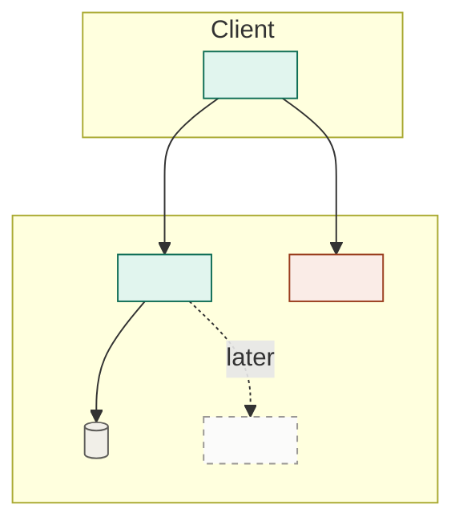

# Vertical slice architecture

Produce `docs/slice-architecture.md`: the architecture that guides how the current slice gets implemented. This is Phase 4, and like the slice PRD it runs once per slice.

Four constraints define it:

- **Doesn't contradict** the full-scope architecture (`docs/architecture.md`).
- **Extends what already runs without breaking it** — from slice 02 on.
- **Delivers the slice's core features without overengineering.**
- **Built so later work can grow it** toward full scope.

The tension is the whole point: lean enough that you're not building for scope you don't have yet, but shaped so full scope plugs in rather than forcing a rewrite.

**From slice 02 on, you are not designing on a blank page.** A running system is a harder constraint than a north star, because it is already true. Most of what follows is about telling three things apart: what this slice adds, what it attaches to, and what it changes.

> Part of the **dev system** — see the `dev-system` skill for the full pipeline, the artifact map, and the principles that hold across every phase.

## Working conventions (shared across the dev system)

Artifacts under `docs/` by default:

- `docs/architecture.md`, `docs/slice-prd.md` — read these
- `docs/completed-slices/<NN>-<slug>/` — earlier slices; their architectures are what already runs
- `docs/slice-architecture.md` — this skill
- `docs/implementation-plan.md`
- `docs/steps/<NN>-<slug>.md`

Control comes from the operator reviewing each checkpoint. Overengineering is the failure mode here, so make it easy to spot: for anything beyond the slice's needs, say why it earns its place now.

**Reference links.** Write every section reference as a markdown link to the file and line it lives at — `[3.2.4](docs/prd.md#L142)`, `[slice-prd.md § In scope → Auth](docs/slice-prd.md#L34)` — with the visible text left as the plain reference. Resolve the line by finding the heading (`grep -n`); never guess it. See the `dev-system` skill for the full rule.

## Method

1. **Read the inputs — including what already runs.** `docs/architecture.md` and `docs/slice-prd.md`. From slice 02 on, also read each architecture in `docs/completed-slices/`, and lean on two of their sections in particular: **Extension points** (seams earlier slices left for exactly this) and **Deliberately deferred** (structure consciously postponed, which this slice may be the one to finally need).
2. **Locate the slice against what exists.** Before designing anything, sort the slice's work into three kinds, because they carry very different risk:

   - **Adds** — new components standing alongside what runs. The cheap case.
   - **Attaches** — plugs into an extension point an earlier slice left. Check the seam is actually there and actually fits; a seam predicted wrong is far cheaper to find here than in implementation.
   - **Changes** — reshapes something already built: splitting a module, promoting an inline thing to a real component, finally adding a layer that was deferred. **This is where regressions come from,** so it gets named explicitly rather than absorbed into "implementation detail."

   If the slice attaches somewhere no earlier slice anticipated, say so. Either the earlier prediction was wrong or this slice is cutting against the grain — both are worth a moment before proceeding.
3. **Simplify to the slice.** Drop or stub anything the slice's features don't require. Fewer moving parts is the goal, not fidelity to the full design.
4. **Stay compatible in both directions.** Don't make a choice the full-scope architecture would have to undo, *and* don't make one that fights what's already running. When the two disagree — the north star says one thing, the code that exists says another — **reality wins for this slice, and you flag the drift** rather than quietly pretending it isn't there. The north star is a north star; by slice 03 some divergence is expected and healthy. What isn't healthy is nobody noticing.
5. **Mark the extension points.** Where deferred features will later attach (from the slice PRD's "Still remaining after this slice"), leave a clear seam — a note on where and how full scope plugs in. This is what makes the slice growable instead of throwaway, and it is what the *next* slice's step 2 will read.
6. **Draw the slice.** One mermaid flowchart, same base conventions as the full-scope diagram — subgraphs by deployment boundary, weighted edges, explicit `fill`/`stroke`/`color` on every class. What differs is the axis you colour on: a slice diagram colours by **what this slice does to each component**, since the subgraphs already carry what kind of thing it is. Four states, straight out of step 2:

   - **Adds** — new in this slice.
   - **Changes** — already there, reshaped here. The category worth staring at.
   - **Untouched** — already running, not affected. Muted. For slice 01 there is none, and the diagram degrades to a plain one.
   - **Deferred** — the seams from step 5, as dashed ghosts. Drawing what you are *not* building is what makes it easy to keep not building it.

   Underneath, write **one line naming what it proves.** For a slice that's usually restraint: what a reader should notice is how much of the north star isn't there. If your slice diagram has as many boxes as the full-scope one, you didn't slice — go back to step 3.
7. **Resist overengineering.** No abstraction, layer, or generality that the slice's features don't currently need. If you're adding it "for later," a marked extension point is enough — build it later.

## Structure

```
# <Project> — Slice <NN> architecture: <slug>

## Overview
The slice's structure in a paragraph. Deliberately smaller than the north star.

## Builds on
What already runs that this slice attaches to, and which extension point from
an earlier slice it lands on. For slice 01: "nothing — first slice." If it
attaches where nothing anticipated it, say so; that's a signal, not a detail.

## Slice diagram
One mermaid flowchart — see Diagram conventions below. One line underneath
naming what it proves, plus a legend for the four states.

## Components for the slice
Only the parts the slice needs, and what each owns. New components only.

## Changes to existing structure
Anything already built that this slice modifies, splits, promotes, or
replaces — kept separate from what it adds, because the risk is different.
**Empty is a good answer.** Each entry: what changes, why the slice can't
proceed without it, and what could regress.

## Data model (slice)
The entities the slice touches, conceptually — marking which are new and
which already exist and are being extended.

## Key choices
The picks for the slice, each with a one-line why — a note where it matches
the full-scope architecture, and a note where a decision from an earlier
slice constrained it.

## Divergence from the north star
Where this slice knowingly differs from `docs/architecture.md`, and whether
that's the slice bending or the north star being out of date. Omit if none.

## Extension points
Where deferred features attach later. The seams that keep this growable, and
what the next slice will read.

## Deliberately deferred
Structure intentionally not built yet, so nobody adds it by reflex.
```

## Diagram conventions

The base conventions are the full-scope architecture's: mermaid, subgraphs for deployment boundaries, `[( )]` cylinders for anything that stores state, weighted edges (plain for the normal path, `==>` for high-volume, `-.->` for scheduled or occasional), and `fill`/`stroke`/`color` set together on every class so labels survive both themes.

The addition is the four build-states from method step 2:



Four classes on **one** axis — what this slice does to the thing. Don't also colour-code component type; a diagram carrying two axes stops being readable, and the subgraphs already handle the second one. Put a one-line legend under the diagram naming the four shades.

## Checkpoint

Present the slice architecture and put the operator's attention on two things: **what this slice changes in existing structure** — the additive parts are cheap, the changes are where regressions live — and where you resisted building ahead, which the diagram's ghost nodes show at a glance. Confirm it doesn't fight the north star, or that any divergence is deliberate and named. Get agreement before generating the implementation plan.

**Next step.** End the checkpoint with a single sentence naming what runs next — e.g. *"Next: Phase 5, `implementation-plan`, to break this slice into reviewable, independently testable steps."* Suggest it; don't run it.
